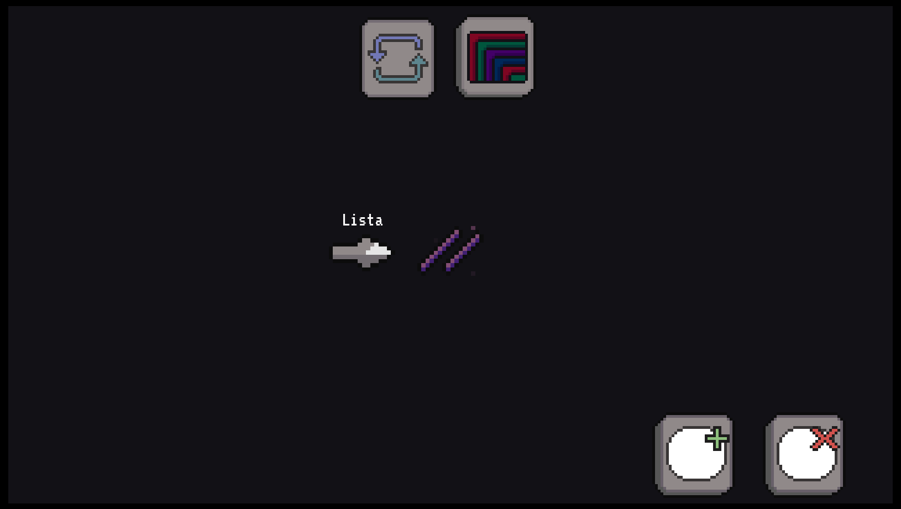
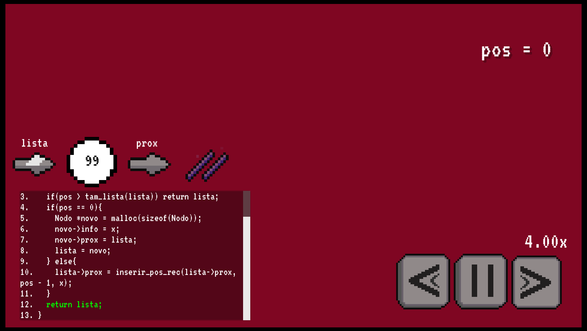
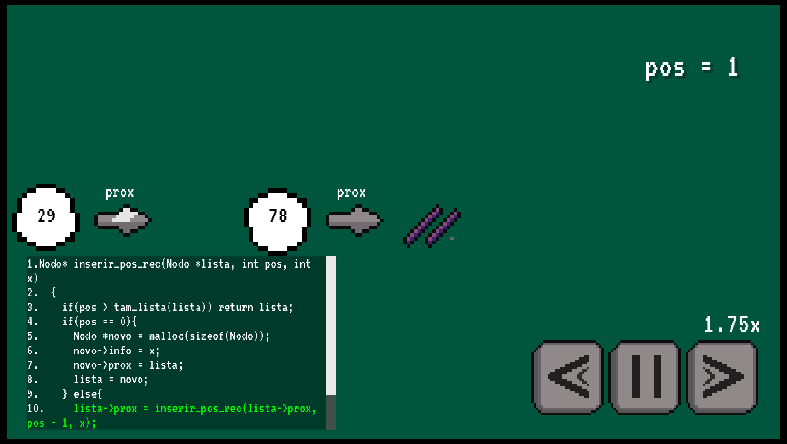
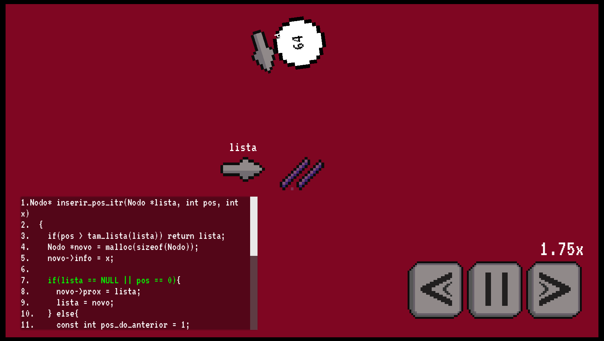

# elab:aed1

Uma visualização da execução de algoritmos de inserção e remoção de nodos em uma lista ligada, iterativos ou recursivos, 

- Linhas de código respectivas à etapa de animação e da execução do algoritmo são destacadas.
- É possível acelerar, desacelerar, e pausar a execução da animação.

## Galeria

